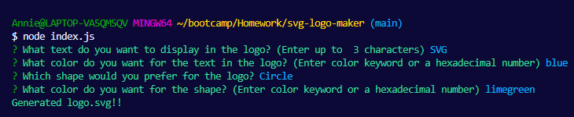
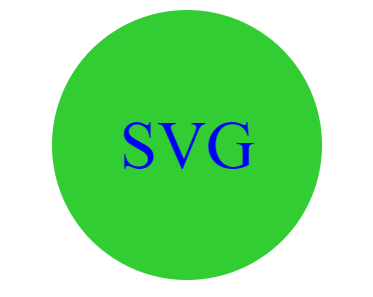

# SVG Logo Generator
  

  ## Description

This application is for a SVG logo generator using node.js, inquirer, and jest. It will allow users to generate a SVG logo with content from answers given to the prompted questions. The shape of the logo can be a Triangle, Square, or Circle, and can only have up to three characters chosen to be displayed within the logo.

  ## Table of Contents
  - [Installation](#installation)
  - [Usage](#usage)
  - [License](#license)
  - [Questions](#questions)

  ## Installation

Git clone the repository.

Please make sure that Inquirer and Jest dependencies has been downloaded. If not, please run the following command:

`npm i inquirer@8.2.4`

`npm i jest`

This will install the Inquirer and Jest packages and version which is necessary for the application to run in. Learn more about [Inquirier](https://www.npmjs.com/package/inquirer) and [Jest](https://www.npmjs.com/package/jest)

  ## Usage

[Recording of Application](https://drive.google.com/file/d/10ENnS4VtGkTzdl_KPWb7t9jylQyaD5e3/view)

To generate a SVG logo, please run the following command in your integrated terminal for this repository:

`node index.js`

Answer the following prompt questions and your logo will be created with your input and selections.

Result example after answering the prompts:

  ## License

This project is licensed under MIT. Please check LICENSE document in repository for more information.

  ## How to Contribute

If you would like to contribute to this project, please open a new issue or submit a pull request.

  ## Tests

To run the test for this application please type the following command into the integrated terminal within this repository:

`npm run test`

There is currently a test for the Shapes, Triangle, Square, Circle, and SVG classes.

  ## Questions

  If you have any questions, feel free to reach me at [GitHub](https://github.com/Annie-McElroy) or via email at [annie.mcelroy8522@gmail.com](annie.mcelroy8522@gmail.com).